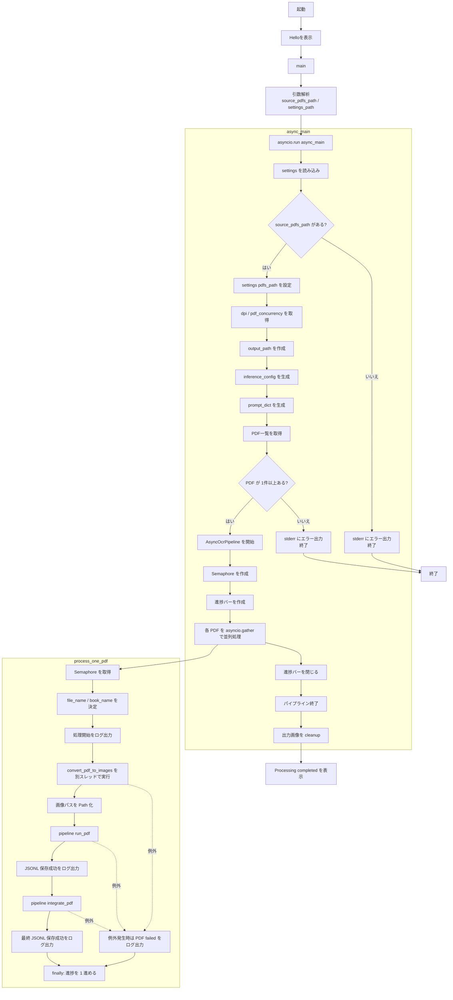
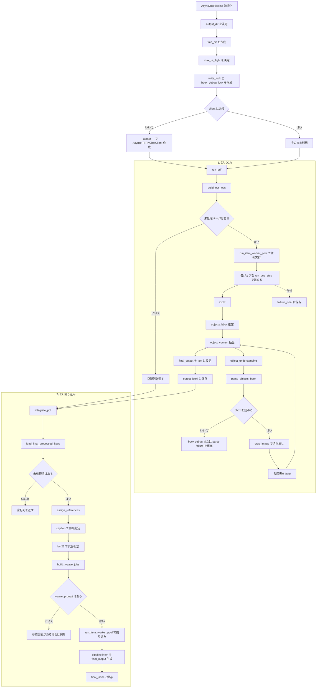

# main_1_ocr_async_pool.py フロー図

```mermaid
flowchart TD
    A[起動] --> B[Helloを表示]
    B --> C[main]
    C --> D[引数解析<br/>source_pdfs_path / settings_path]
    D --> E[asyncio.run async_main]

    subgraph S[async_main]
        E --> F[settings を読み込み]
        F --> G{source_pdfs_path がある?}
        G -- いいえ --> G1[stderr にエラー出力<br/>終了]
        G -- はい --> H[settings pdfs_path を設定]
        H --> I[dpi / pdf_concurrency を取得]
        I --> J[output_path を作成]
        J --> K[inference_config を生成]
        K --> L[prompt_dict を生成]
        L --> M[PDF一覧を取得]
        M --> N{PDF が 1件以上ある?}
        N -- いいえ --> N1[stderr にエラー出力<br/>終了]
        N -- はい --> O[AsyncOcrPipeline を開始]
        O --> P[Semaphore を作成]
        P --> Q[進捗バーを作成]
        Q --> R[各 PDF を asyncio.gather で並列処理]
        R --> Z[進捗バーを閉じる]
        Z --> AA[パイプライン終了]
        AA --> AB[出力画像を cleanup]
    end

    subgraph T[process_one_pdf]
        R --> S1[Semaphore を取得]
        S1 --> S2[file_name / book_name を決定]
        S2 --> S3[処理開始をログ出力]
        S3 --> S4[convert_pdf_to_images を別スレッドで実行]
        S4 --> S5[画像パスを Path 化]
        S5 --> S6[pipeline run_pdf]
        S6 --> S7[JSONL 保存成功をログ出力]
        S7 --> S8[pipeline integrate_pdf]
        S8 --> S9[最終 JSONL 保存成功をログ出力]
        S4 -. 例外 .-> S10[例外発生時は PDF failed をログ出力]
        S6 -. 例外 .-> S10
        S8 -. 例外 .-> S10
        S10 --> S11[finally: 進捗を 1 進める]
        S9 --> S11
    end

    AB --> AC[Processing completed を表示]
    G1 --> AD[終了]
    N1 --> AD
```

## パイプライン内部フロー

```mermaid
flowchart TD
    A[AsyncOcrPipeline 初期化] --> B[output_dir を決定]
    B --> C[tmp_dir を作成]
    C --> D[max_in_flight を決定]
    D --> E[write_lock と bbox_debug_lock を作成]
    E --> F{client はある}
    F -- いいえ --> G[__aenter__ で AsyncHTTPXChatClient 作成]
    F -- はい --> H[そのまま利用]
    G --> I[run_pdf]
    H --> I

    subgraph OCR[1パス OCR]
        I --> J[build_ocr_jobs]
        J --> K{未処理ページはある}
        K -- いいえ --> K1[空配列を返す]
        K -- はい --> L[run_item_worker_pool で並列実行]
        L --> M[各ジョブを run_one_step で進める]
        M --> N[OCR]
        N --> O[objects_bbox 推定]
        O --> P[object_content 抽出]
        P --> Q[final_output を text に設定]
        Q --> R[output_jsonl に保存]
        P --> P1[object_understanding]
        P1 --> P2[parse_objects_bbox]
        P2 --> P3{bbox を読める}
        P3 -- いいえ --> P4[bbox debug または parse failure を保存]
        P3 -- はい --> P5[crop_image で切り出し]
        P5 --> P6[各図表を infer]
        P6 --> P
        M -. 例外 .-> S[failure_jsonl に保存]
    end

    R --> T[integrate_pdf]
    K1 --> T

    subgraph INTEG[2パス 織り込み]
        T --> U[load_final_processed_keys]
        U --> V{未処理行はある}
        V -- いいえ --> V1[空配列を返す]
        V -- はい --> W[assign_references]
        W --> X[caption で参照判定]
        X --> Y[bm25 で代替判定]
        Y --> Z[build_weave_jobs]
        Z --> AA{weave_prompt はある}
        AA -- いいえ --> AB[参照図表がある場合は例外]
        AA -- はい --> AC[run_item_worker_pool で織り込み]
        AC --> AD[pipeline.infer で final_output 生成]
        AD --> AE[final_jsonl に保存]
    end
```
